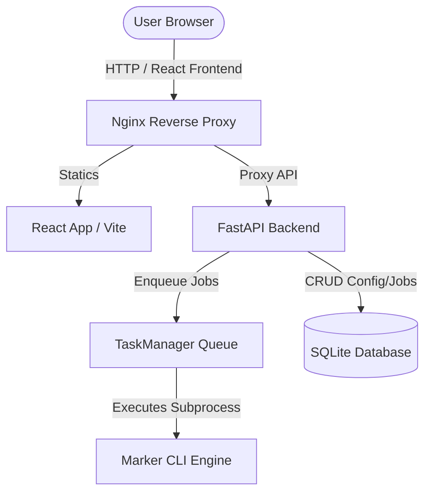

# Technical Architecture

Marker UI uses a decoupled client-server architecture designed to execute resource-heavy machine learning workflows locally while ensuring smooth UI/UX.

---

## System Context Diagram

---

## Structural Components

1. **Frontend (Vite / React 19 / TypeScript)**:
   - Houses the client interface.
   - Polls settings and onboarding progress.
   - Connects to SSE streams to render conversion console logs.
2. **Reverse Proxy (Nginx)**:
   - Configured in Docker deployments.
   - Directs traffic to static assets or routes API endpoints to FastAPI.
3. **Backend API (FastAPI / Python)**:
   - Exposes REST endpoints to query and write settings, fetch job history, and handle file uploads.
   - Performs encryption on sensitive settings credentials using Fernet.
4. **Task Manager (Thread Queue)**:
   - An in-memory concurrent worker queue.
   - Offloads conversion execution from the FastAPI request thread pool.
   - Tracks stdout/stderr of running child processes.
5. **Marker Conversion Engine**:
   - The deep learning models package. Runs OCR, page layout segmenter, and equation formatting.
6. **SQLite Database**:
   - Stores job metadata, progress status, and encrypted settings.
